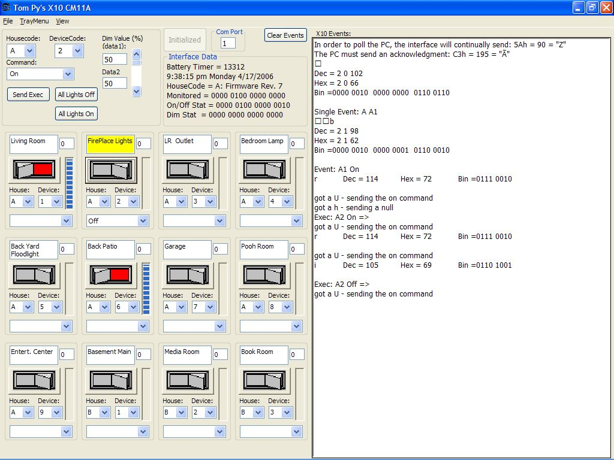



## X10CM11AClass

### Description

X10 put out some nifty home control products that communicate

over the power lines and respond to commands to turn on; turn off; dim; etc.

The CM11A is device that interfaces a pc to the command line protocol and also

contains timers and macros.

This project is a class I wrote to emulate what the keware ocx does.

Keware (http://www.homeseer.com/downloads/index.htm)

It can control devices in any housecode from your pc. It also monitors devices that are turned on or off from a remote or firecracker interface and raises events when this happens.

The HouseCode can be any 1 of 16 (A through P) and each house code can handle

any of 16 devices (1 to 16).

I started out with the firecracker class I wrote

http://www.planet-source-code.com/vb/scripts/ShowCode.asp?txtCodeId=64719&amp;lngWId=1

and I experimented with it and took information from the x10 protocol file

I made some switches and used a vertical progress bar to set the dim level.

I implemented a device status for each device. Finally, I was able to implement

the all on and all off commands.

Of course all of this is useless if you don't have the x10 hardware that it
 
### More Info
 
You must have the x10 CM11a pc interface and some x10 modules.

             |
---                |---
**Submitted On**   |2006-04-17 21:46:24
**By**             |[Tom Pydeski](https://github.com/Planet-Source-Code/PSCIndex/blob/master/ByAuthor/tom-pydeski.md)
**Level**          |Intermediate
**User Rating**    |5.0 (20 globes from 4 users)
**Compatibility**  |VB 6\.0
**Category**       |[Complete Applications](https://github.com/Planet-Source-Code/PSCIndex/blob/master/ByCategory/complete-applications__1-27.md)
**World**          |[Visual Basic](https://github.com/Planet-Source-Code/PSCIndex/blob/master/ByWorld/visual-basic.md)
**Archive File**   |[X10CM11ACl1987894172006\.zip](https://github.com/Planet-Source-Code/tom-pydeski-x10cm11aclass__1-65040/archive/master.zip)

